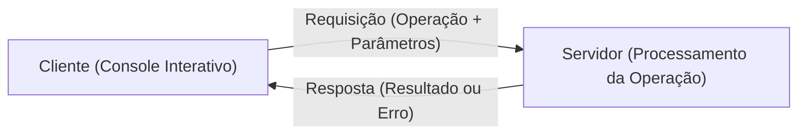
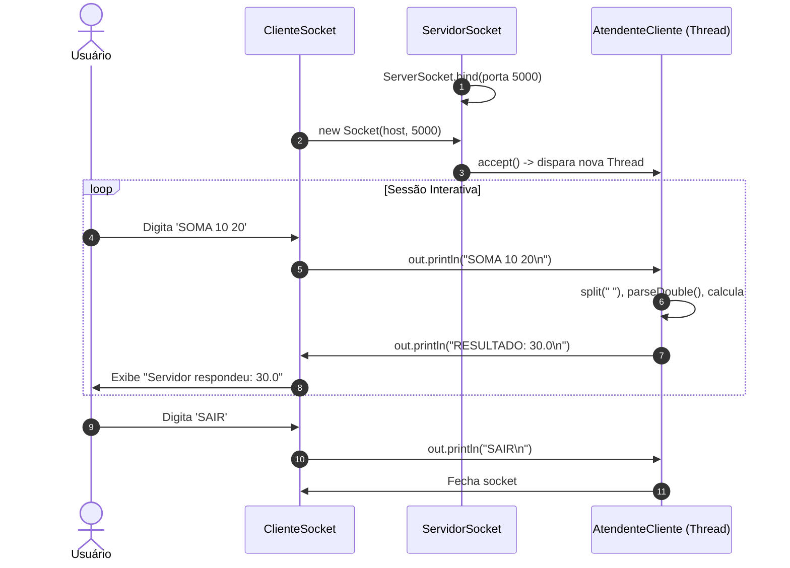
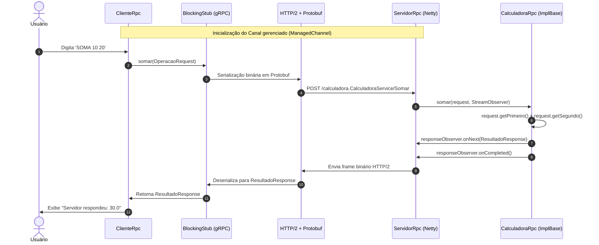
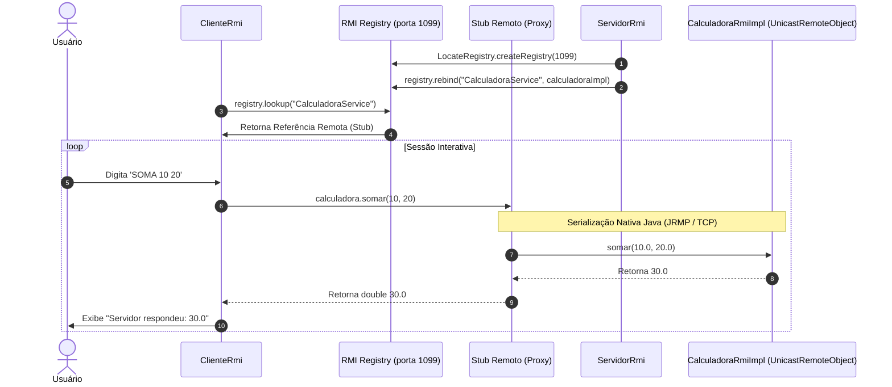
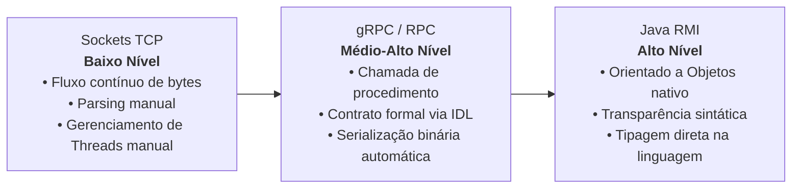

# Relatório Comparativo: Comunicação Distribuída com Sockets TCP, gRPC (RPC) e Java RMI

**Instituição:** Instituto Federal do Norte de Minas Gerais (IFNMG)  
**Disciplina:** Sistemas Distribuídos  
**Autores:** JoaoKSS e andref03  
**Repositório:** [Socket-RPC-RMI](https://github.com/andref03/Socket-RPC-RMI)  

---

## 1. Introdução e Aplicação Escolhida

### 1.1. Contextualização
A evolução dos sistemas distribuídos trouxe diferentes paradigmas de comunicação entre processos remotos, variando desde o controle de baixo nível sobre fluxos de bytes até abstrações de alto nível que ocultam a complexidade de rede e fazem invocações remotas se assemelharem a chamadas locais de métodos.

O objetivo deste trabalho prático é implementar e comparar três abordagens fundamentais de computação distribuída:
1. **Sockets de Rede (TCP)**
2. **RPC (Remote Procedure Call)** utilizando **gRPC** com Protocol Buffers
3. **RMI (Remote Method Invocation)** com Java RMI nativo

### 1.2. Aplicação Escolhida: Calculadora Distribuída
Para permitir uma comparação estritamente técnica entre os mecanismos de comunicação, foi escolhida uma **Calculadora Distribuída** como aplicação comum entre as três versões.

A calculadora disponibiliza quatro operações matemáticas básicas:
- **SOMA** ($a + b$)
- **SUB** ($a - b$)
- **MULT** ($a \times b$)
- **DIV** ($a \div b$), com tratamento explícito de divisão por zero.

O fluxo de interação é contínuo e interativo: o cliente se conecta ao servidor, entra em um laço de leitura de comandos no console (`> SOMA 10 20`), envia os parâmetros, recebe a resposta computada pelo servidor remoto e exibe o resultado formatado até que o comando `SAIR` seja emitido.



---

## 2. Arquitetura e Implementação das Três Abordagens

### 2.1. Abordagem 1: Sockets TCP

#### Arquitetura
A versão em Sockets opera na camada de transporte da pilha TCP/IP. Ela utiliza sockets de fluxo orientados a conexão (`ServerSocket` e `Socket`), garantindo entrega confiável e ordenada de pacotes de dados através do protocolo TCP.



#### Detalhes de Implementação
- **Protocolo de Aplicação Textual**: Como os Sockets não oferecem empacotamento semântico automático, foi desenvolvido um protocolo baseado em linhas de texto delimitadas por quebra de linha (`\n`):
  - Formato de requisição: `<OPERACAO> <NUM1> <NUM2>` (ex: `SOMA 10 20`)
  - Formato de resposta: `RESULTADO: <VALOR>` ou `ERRO: <MENSAGEM>`
- **Concorrência Multithread**: O `ServidorSocket` opera em laço aceitando conexões com `serverSocket.accept()`. Para cada cliente conectado, uma instância da classe executável `AtendenteCliente` é instanciada e delegada para uma nova `Thread`, permitindo que múltiplos clientes operem concorrentemente sem bloqueio mútuo.
- **Serialização/Deserialização**: Realizada manualmente através de `BufferedReader` (`readLine()`), `PrintWriter` e `String.split("\\s+")`.

---

### 2.2. Abordagem 2: gRPC (RPC - Remote Procedure Call)

#### Arquitetura
O gRPC é um framework RPC de alta performance moderno, de código aberto mantido pela Cloud Native Computing Foundation (CNCF). A comunicação baseia-se na definição formal de um contrato estrito de interface (IDL - Interface Definition Language) utilizando **Protocol Buffers** (proto3) e transportada sobre **HTTP/2**.



#### Detalhes de Implementação
- **Contrato IDL (`calculadora.proto`)**: O serviço foi definido no arquivo de proto:
  ```protobuf
  syntax = "proto3";
  option java_multiple_files = true;
  option java_package = "org.ifnmg.rpc";

  service CalculadoraService {
    rpc Somar (OperacaoRequest) returns (ResultadoResponse);
    rpc Subtrair (OperacaoRequest) returns (ResultadoResponse);
    rpc Multiplicar (OperacaoRequest) returns (ResultadoResponse);
    rpc Dividir (OperacaoRequest) returns (ResultadoResponse);
  }

  message OperacaoRequest {
    double primeiro = 1;
    double segundo = 2;
  }

  message ResultadoResponse {
    double resultado = 1;
  }
  ```
- **Geração de Código Automática**: O plugin `protobuf-maven-plugin` compila o arquivo `.proto` gerando as classes de transporte fortemente tipadas (`OperacaoRequest`, `ResultadoResponse`) e a classe base do serviço (`CalculadoraServiceImplBase`).
- **Servidor**: O `ServidorRpc` utiliza a biblioteca `grpc-netty-shaded` para subir um servidor gRPC na porta `8080` com `ServerBuilder.forPort(porta).addService(new CalculadoraRpc()).build().start()`.
- **Cliente**: Conecta-se via `ManagedChannelBuilder.forAddress(host, porta).usePlaintext().build()` e invoca os métodos de forma síncrona através de um stub bloqueante gerado (`CalculadoraServiceBlockingStub`).

---

### 2.3. Abordagem 3: Java RMI (Remote Method Invocation)

#### Arquitetura
O Java RMI estende o modelo de objetos nativo do Java para ambientes distribuídos. Ele permite que uma aplicação cliente invoque diretamente métodos de um objeto que reside em outra Máquina Virtual Java (JVM), abstraindo a rede através de um par *Stub* (no cliente) e *Skeleton/Dispatcher* (no servidor).



#### Detalhes de Implementação
- **Interface Remota (`CalculadoraRmi`)**: Define o contrato estendendo a interface marcadora `java.rmi.Remote`. Cada método remoto declara obrigatoriamente a exceção `RemoteException`:
  ```java
  public interface CalculadoraRmi extends Remote {
      double somar(double a, double b) throws RemoteException;
      double subtrair(double a, double b) throws RemoteException;
      double multiplicar(double a, double b) throws RemoteException;
      double dividir(double a, double b) throws RemoteException, ArithmeticException;
  }
  ```
- **Implementação do Objeto Remoto (`CalculadoraRmiImpl`)**: Herda de `java.rmi.server.UnicastRemoteObject`, o que a torna receptiva para escutar e responder chamadas remotas ponto a ponto através de sockets TCP efêmeros.
- **RMI Registry e Naming Lookup**: O `ServidorRmi` cria programaticamente o registro de nomes na porta `1099` com `LocateRegistry.createRegistry(1099)` e registra a instância remota sob o identificador `"CalculadoraService"`. O cliente localiza a referência usando `LocateRegistry.getRegistry(host, porta).lookup("CalculadoraService")`.
- **Transparência de Localização**: Após a obtenção da referência remota, a chamada `calculadora.somar(a, b)` sintaticamente em nada difere de uma invocação de método em um objeto local da JVM.

---

## 3. Análise Comparativa Detalhada

### 3.1. Nível de Abstração Oferecido



1. **Sockets (Baixo Nível)**: O desenvolvedor é responsável por todas as etapas da comunicação: abertura do socket, empacotamento de dados, formatação de strings, controle do delimitador de mensagens, tratamento de parsing e divisão de threads. Não há conceito de "procedimento" ou "objeto".
2. **gRPC (Médio-Alto Nível)**: Oferece o conceito de chamada de procedimento remoto. O transporte e a codificação binária são completamente transparentes. Contudo, há uma clara distinção entre objetos locais e mensagens de requisição/resposta (`OperacaoRequest` / `ResultadoResponse`), mantendo o desenvolvedor ciente dos limites da rede.
3. **Java RMI (Alto Nível)**: Integração profunda com a linguagem Java. Oferece quase total transparência de invocação: o cliente invoca métodos em uma interface comum, passando parâmetros primitivos ou objetos serializáveis e recebendo retornos diretamente.

---

### 3.2. Diferenças de Implementação e Protocolo

| Critério | Sockets TCP | gRPC (RPC) | Java RMI |
| :--- | :--- | :--- | :--- |
| **Protocolo de Transporte** | TCP puro (camada de transporte) | HTTP/2 sobre TCP | JRMP (Java Remote Method Protocol) sobre TCP |
| **Formato dos Dados** | Texto plano delimitado (`\n`) | Binário Protocol Buffers (Proto3) | Binário Java Serialization |
| **Estrutura de Contrato** | Nenhuma (acordo implícito de strings) | Arquivo de IDL (`.proto`) | Interface Java (`extends Remote`) |
| **Gerenciamento de Threads** | Manual (`Thread` dedicada por conexão) | Automático (pool gerenciado pelo Netty) | Automático (pool gerenciado pelo runtime do RMI) |
| **Tipagem dos Parâmetros** | Fraca (requer `Double.parseDouble`) | Forte (definida estritamente no schema) | Forte (verificada pelo compilador Java) |
| **Interoperabilidade** | Universal (qualquer linguagem) | Universal (suporte nativo multi-linguagem) | Restrita (apenas ecossistema Java / JVM) |
| **Dependências Externas** | Nenhuma (Java SDK padrão) | Bibliotecas gRPC, Protobuf e Netty | Nenhuma (Java SDK padrão) |
| **Tamanho da Mensagem** | Pequeno (texto cru) | Mínimo (binário comprimido com tags) | Médio a Alto (overhead de metadados da serialização Java) |

---

### 3.3. Facilidade de Uso e Complexidade

- **Sockets**:
  - *Facilidade de início*: Alta para testes rápidos e pequenos.
  - *Complexidade de manutenção*: Muito alta à medida que o sistema cresce. Adicionar novas operações exige alterar o parser de string em ambos os lados e tratar manualmente todos os casos de borda.
- **gRPC**:
  - *Facilidade de início*: Média/Baixa, pois exige configurar ferramentas de build (Maven com `protobuf-maven-plugin`), compiladores nativos (`protoc`) e aprender a sintaxe do Protocol Buffers.
  - *Complexidade de manutenção*: Baixa. A adição de novas operações é simples: basta declarar no `.proto`, rodar a compilação e implementar os métodos tipados. O compilador acusa em tempo de compilação qualquer incompatibilidade.
- **Java RMI**:
  - *Facilidade de início*: Alta para desenvolvedores Java, já que vem integrado ao JDK sem necessidade de dependências extras.
  - *Complexidade de manutenção*: Média. Alterações de interfaces exigem recompilação e compatibilidade de `serialVersionUID`.

---

## 4. Vantagens e Desvantagens Percebidas

### 4.1. Sockets TCP
- **Vantagens**:
  - Independência total de frameworks ou bibliotecas externas.
  - Controle granular sobre buffers, timeouts, portas e ciclo de vida das conexões.
  - Permite criar protocolos proprietários ultraleves.
- **Desvantagens**:
  - Grande quantidade de código repetitivo (*boilerplate*).
  - Propensão a erros de parsing e formatação de texto em tempo de execução.
  - Não oferece abstração de procedimentos ou tipos.
  - Risco de bloqueio do servidor caso o controle de threads não seja projetado adequadamente.

### 4.2. gRPC (RPC)
- **Vantagens**:
  - Alto desempenho e baixo consumo de largura de banda graças à serialização binária do Protocol Buffers e multiplexação do HTTP/2.
  - Interoperabilidade total entre diferentes linguagens (servidor em Java, cliente em Python, Go, Node.js ou C# sem alterações).
  - Geração de código automática (stubs) robusta e fortemente tipada.
  - Suporte nativo a chamadas síncronas, assíncronas e *streaming* bidirecional.
- **Desvantagens**:
  - Curva de aprendizado inicial mais acentuada.
  - Dependência do ciclo de compilação de arquivos `.proto`.
  - Depuração em rede mais desafiadora (payload binário não é legível como texto simples sem ferramentas adequadas).

### 4.3. Java RMI
- **Vantagens**:
  - Integração natural e elegante com o paradigma de Orientação a Objetos do Java.
  - Facilidade de chamada: o código cliente manipula o objeto remoto exatamente como se fosse local.
  - Sem necessidade de bibliotecas de terceiros (nativo do JDK).
- **Desvantagens**:
  - Totalmente restrito a aplicações Java (acoplamento tecnológico à JVM).
  - A serialização nativa do Java é mais verbosa e historicamente vulnerável a problemas de segurança quando exposta a redes públicas.
  - Requer serviço de nomes auxiliar ativo (RMI Registry) e configurações adicionais para contornar roteamento de IP em redes com NAT.

---

## 5. Dificuldades Encontradas Durante o Desenvolvimento

1. **Protocolo e Parsing no Socket**:
   - Garantir que espaços múltiplos, quebras de linha e entradas com caracteres especiais não quebrassem a leitura do servidor.
   - Tratar a divisão por zero e formatações incorretas enviando respostas de erro claras (`ERRO: ...`) sem derrubar a conexão da sessão.
2. **Ambiente e Plugins do gRPC**:
   - Configuração do plugin `protobuf-maven-plugin` no `pom.xml`, que depende de artefatos nativos do `protoc` de acordo com a arquitetura do sistema operacional (`os-maven-plugin` para Linux x86_64).
   - Reconhecimento das pastas de código-fonte gerado (`target/generated-sources/protobuf/...`) no Java Language Server do VS Code.
3. **Gerenciamento do RMI Registry e Rede**:
   - Criação programática do registro RMI na porta `1099` através do `LocateRegistry.createRegistry()` evitando falhas caso uma instância do registro já estivesse em execução no host.
   - Configuração da propriedade `java.rmi.server.hostname` para viabilizar conexões entre máquinas distintas em redes locais com múltiplos adaptadores de rede.
4. **Padronização Multi-Módulo**:
   - Estruturação de um repositório multi-módulo Maven com um `pom.xml` pai na raiz agregando os subprojetos `Socket`, `RPC` e `RMI`, permitindo a compilação integrada e execução padronizada por meio de perfis Maven (`-Pservidor` e `-Pcliente`).

---

## 6. Casos de Uso Práticos na Indústria

- **Quando utilizar Sockets TCP**:
  - Aplicações que necessitam de latência mínima e protocolos proprietários especializados, como motores de **jogos multiplayer em tempo real**, sistemas de monitoramento de sensores IoT industriais ou servidores de mensageria customizados.
- **Quando utilizar gRPC (RPC)**:
  - Arquiteturas modernas de **Microsserviços de alta escala** (como em infraestruturas na nuvem na Netflix, Google e Uber), onde serviços escritos em linguagens diferentes precisam se comunicar com altíssima taxa de transferência, baixa latência e contratos de interface rigorosos.
- **Quando utilizar Java RMI**:
  - Sistemas corporativos e bancários legados desenvolvidos estritamente em Java (como plataformas Java EE/Jakarta EE antigas com EJB), ou aplicações distribuídas acadêmicas/internas onde toda a infraestrutura é garantidamente baseada na JVM.

---

## 7. Instruções de Execução Padronizada

Graças à padronização implementada através de perfis nos arquivos `pom.xml`, todas as três aplicações podem ser executadas com os mesmos comandos.

### Compilação Geral
Na raiz do repositório:
```bash
mvn compile
```

### Execução de Cada Versão

#### Opção A: Executando a partir da raiz do repositório
Abra dois terminais:

* **Sockets:**
  - *Terminal 1 (Servidor):* `mvn exec:java -pl Socket -Pservidor`
  - *Terminal 2 (Cliente):* `mvn exec:java -pl Socket -Pcliente`

* **gRPC (RPC):**
  - *Terminal 1 (Servidor):* `mvn exec:java -pl RPC -Pservidor`
  - *Terminal 2 (Cliente):* `mvn exec:java -pl RPC -Pcliente`

* **Java RMI:**
  - *Terminal 1 (Servidor):* `mvn exec:java -pl RMI -Pservidor`
  - *Terminal 2 (Cliente):* `mvn exec:java -pl RMI -Pcliente`

#### Opção B: Executando dentro da pasta de cada tecnologia
Navegue até a pasta desejada (`cd Socket`, `cd RPC` ou `cd RMI`):
- *Terminal 1 (Servidor):* `mvn exec:java -Pservidor`
- *Terminal 2 (Cliente):* `mvn exec:java -Pcliente`

---

## 8. Conclusão

A atividade prática proporcionou uma visão completa sobre o espectro de abstrações em sistemas distribuídos:
- Os **Sockets** permitiram compreender a mecânica elementar de comunicação em redes, evidenciando o esforço necessário para criar e manter protocolos de aplicação manualmente.
- O **gRPC** destacou-se como a solução mais robusta, eficiente e adequada ao mercado contemporâneo, combinando alto desempenho, contratos rigorosos e interoperabilidade de linguagens.
- O **Java RMI** ilustrou com clareza o conceito de transparência de localização na orientação a objetos, embora limitado pela dependência exclusiva da plataforma Java.

A implementação uniforme da Calculadora Distribuída garantiu que a comparação fosse justa e focada nas propriedades estruturais, de desempenho e de usabilidade de cada tecnologia.
